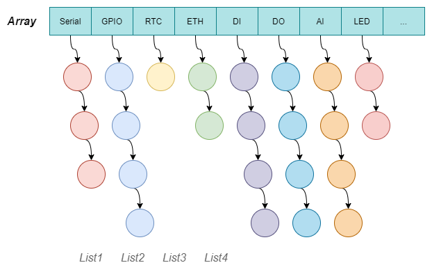

# LDAL

Linux 设备抽象层（Linux Device Abstraction Layer ），是一套基于 Linux 的外部设备管理、测试框架，并为应用提供统一的 API 操作接口，简化应用开发。

- [x] 方案一：类型链表 + 设备链表（永远只有两条链表，前提是不同的设备对象中需要有相同的一个结构体成员）
- [ ] 方案二：数组 + 不同类型的设备链表 * n

风险及难点：对业务功能不熟悉，同时需要兼顾驱动层和上层应用的功能和数据定义。


## 原则

- 兼容原有 API，并尽可能兼容原有设备的操作流程和方式；
- 各个 Class Device 模块不能直接对外提供接口（除了注册接口），必须由 ldal.h 提供；
- 采用面向对象的设计；
- 每一层专注做自己该做的工作，例如设备锁同步在 ldal device 层处理，具体的设备功能在 class device 层处理；


## 特性

- 依赖于设备节点（如 /dev/ttyUSB0）
- 线程安全，支持多线程并发访问
- 支持注册多个同类型设备
- 异步操作
- 接口简单
- 控制任务线程化
- 支持中断调用


## 支持设备

|    类型     | 描述                                                     | 备注 |
| :---------: | -------------------------------------------------------- | :--: |
|   Memory    | 内存空间（Ring Buffer）                                  |  √   |
|    File     | 普通文件                                                 |  √   |
|   Serial    | 设备节点如 /dev/ttyUSB0，包括 RS-232 和 RS-485           |  √   |
|     RTC     | 实时时钟                                                 |  √   |
|    GPIO     | 芯片外设，支持读取、写入、中断、PWM 控制等               |      |
| Digital IO  | 包括 DI、DO                                              |  √   |
| Anlog Input | 模拟量输入（AI）                                         |  √   |
|     LED     | 指示灯控制                                               |      |
|   EEPROM    | 外部存储器                                               |      |
|     UDP     | UDP 套接字                                               |  √   |
|   Socket    | 包括以太网、WiFi、4G 链路                                |      |
|    Misc     | 杂项设备（简单的读写控制类设备，如 battery、ibutton 等） |  √   |


## 工作流程

1. 将需要用到的设备类型注册到 class 链表（数组）（自动注册？还是应用程序注册？）
2. Class 链表初始化，表明当前系统有哪些类型的设备
3. 注册具体的设备节点
4. 通过设备名查找设备（获取设备句柄）
5. 进行 read、write、control 等操作


## 测试工具

list_device 命令行工具


## 设计





## 约束

- 数据类型和函数接口使用 dg 开头作为标识，即 device generic；


## 编译

编译 libldal.so 共享库

```shell
make
```

安装 libldal.so 到系统库目录

```shell
sudo make install
```

编译测试程序

```shell
make testcase
```


## 优化

- [x] 规范 API 参数和返回值
- [x] 初始化流程
- [ ] 统一日志输出
- [ ] 统一前缀
- [ ] 检查指针参数
- [ ] 删除多余的头文件声明
- [ ] 统一返回错误代码（采用系统 errno？）
- [ ] 优化超时阻塞机制：读取阻塞 + 超时 + try 次数
- [ ] 为链表增加 read-write lock 读写锁（设备仍使用 mutex 互斥锁）
- [ ] 实现一个简单的 HTTP 网页展示服务（端口 1601）
- [ ] 增加 JSON + RPC 监控服务
- [ ] 增加虚拟内核模块示例代码
- [ ] 为 socket 设备增加状态管理功能


## APIs

### 注册接口

```c
/* Register device class object */
int ldal_device_class_register(struct ldal_device_class *class, uint16_t class_id);
/* Register device object */
int ldal_device_register(struct ldal_device *device, const char *devname, 
                         const char *filename, uint16_t class_id, void *user_data);
```


### 查找接口

```c
struct ldal_device *ldal_device_get_by_name(const char *name);
struct ldal_device *ldal_device_get_by_name(int type, const char *name);  /* unimplemented */
```


### 操作接口

```c
int startup_device(ldal_device_t * const device);
int stop_device(ldal_device_t * const device);
int read_device(ldal_device_t * const device, void *buff, const size_t len);
int write_device(ldal_device_t * const device, const void *buff, const size_t len);
int control_device(ldal_device_t * const device, int cmd, void *arg);
int config_device(ldal_device_t * const device, int cmd, void *arg);
```

